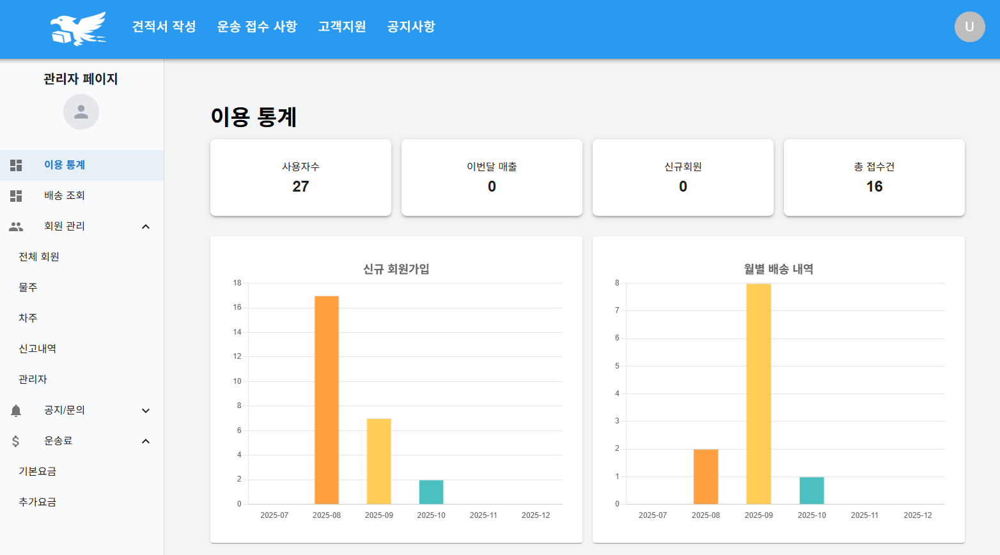
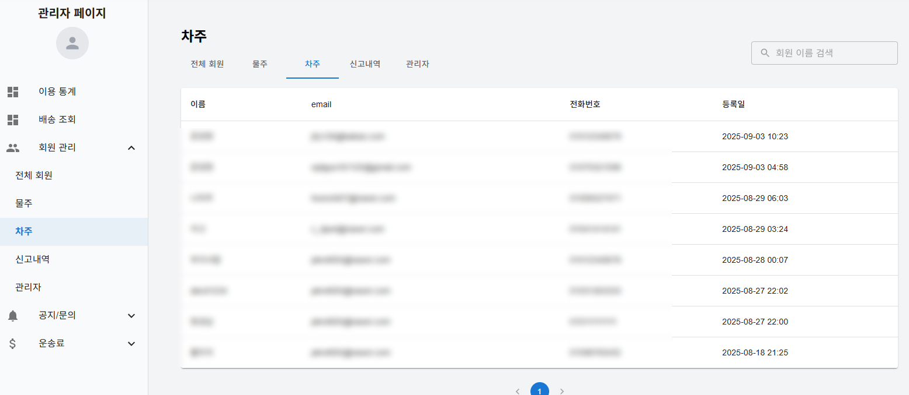
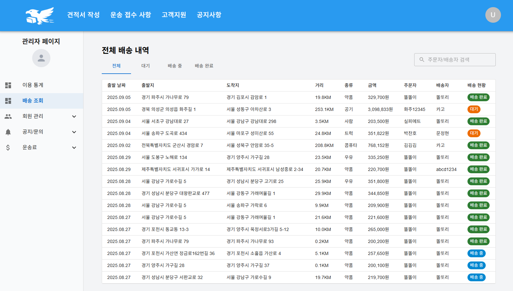
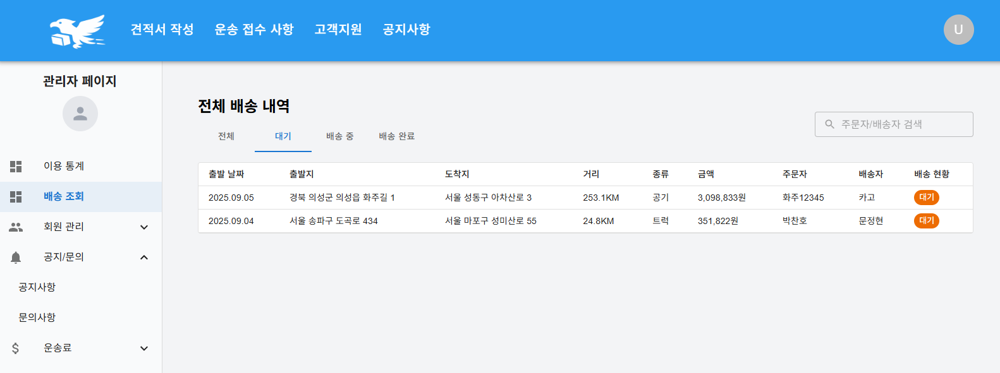
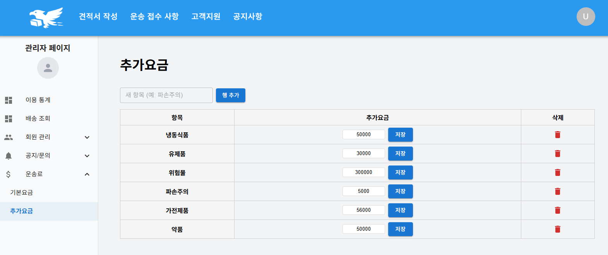
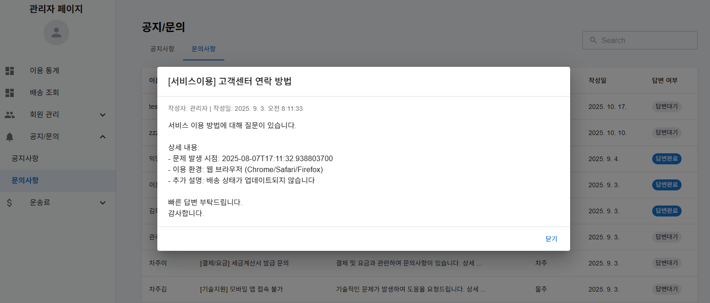
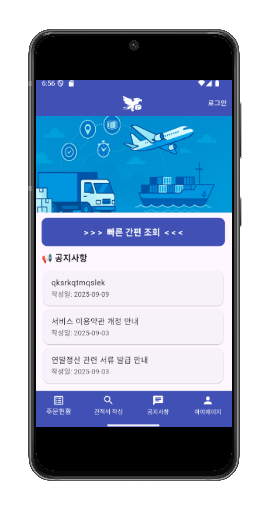
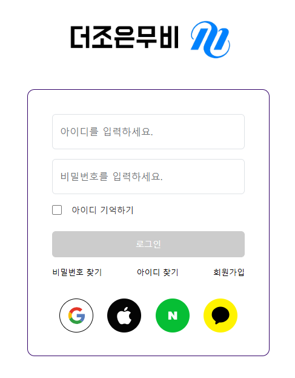
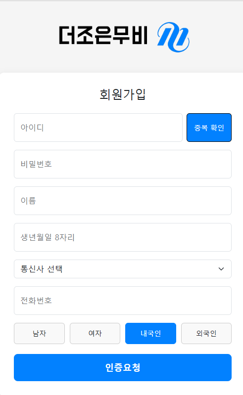
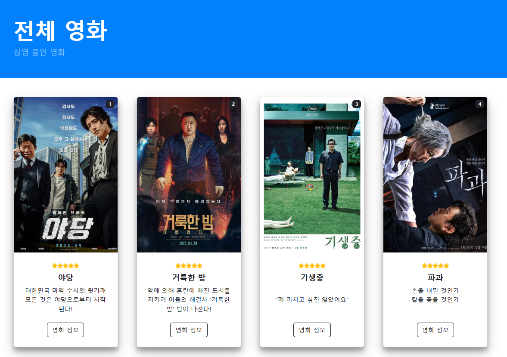

<!--Header-->
  

 

## 🌼 About Me
안녕하세요!  
프론트엔드와 앱을 개발하는 **최예지**입니다.  
UI/UX를 탐구하며 더 나은 인터페이스를 구현하는 데 즐거움을 느낍니다.

 

## 🛠 기술스택

<table width="100%" style="border-collapse: collapse;">
  <tr>
    <th style="border:none;">Frontend</th>
    <th style="border:none;">Backend</th>
    <th style="border:none;">Mobile</th>
    <th style="border:none;">Tools</th>
    <th style="border:none;">Collaboration</th>
  </tr>

  <tr>
    <td align="center" style="border:none;">
      <!-- Frontend -->
      
       
      
       
      
       
      
    </td>
    <td align="center" style="border:none;">
      <!-- Backend -->
      
       
      
       
       
      
    </td>
    <td align="center" style="border:none;">
      <!-- Mobile -->
       
      
    </td>
    <td align="center" style="border:none;">
      <!-- Tools -->
       
      
    </td>
    <td align="center" style="border:none;">
      <!-- Collaboration -->
      
       
      
       
      
    </td>
  </tr>
</table>
 

## 🚀 Projects

### 📦 **화물 운송 플랫폼 (Team Project)** 

> 사용자(의뢰인/화물차주)간의 배송 접수부터 매칭, 관리까지 가능한 화물 운송 플랫폼
> 
> **Stack:** React, Spring Boot, MySQL, Flutter
 

**👩‍💻 My Role**

**1. 📊 Dashboard – 이용 통계 조회 화면**
> 관리자가 운영 현황을 한눈에 파악할 수 있도록  
> 대시보드 레이아웃과 주요 통계 UI를 설계하고 구현했습니다.

**2. 👥 회원 관리 기능**
> 회원 목록 조회 및 역할(화주 / 차주 / 관리자)별 필터링,  
> 신고 내역 확인 및 관리 기능을 구현했습니다.

**3. 🚚 배송 내역 조회**
> 전체 배송 기록을 한 번에 확인할 수 있도록 데이터 테이블 UI 구성,  
> 상태별 정렬 및 검색을 지원하도록 구현했습니다.

**4. 🛠 운송료 조정 & 운영 관리**
> 관리자가 요금 정책을 유연하게 조정할 수 있도록 운송료 설정 페이지를 구현하고,  
> 사용자의 문의 상태(답변대기 / 답변완료)를 한눈에 확인할 수 있는 UI를 설계·구현했습니다. 

**5. Mobile App – 메인 페이지 구현 (Flutter)**
> Flutter를 활용하여 앱 메인 페이지를 설계·개발했습니다.  
> 상단 AppBar, 하단 네비게이션 바, 메인 배너 UI, 공지사항 리스트를 구성하여  
> 사용자가 주요 기능에 빠르게 접근할 수 있도록 직관적인 화면을 구현했습니다.

### 🔗 Links

- 🔥 **[서비스 바로가기](http://3.35.164.168/)** 

- 📄 [웹 구현 PPT](./ppt/G2I4_화물운송프로젝트_최종본.pdf) / [앱 구현 PPT](./ppt/2조(G2I4)3차프로젝트ppt.pdf)
 

---

### 🎬 영화 예매 사이트 (Team Project)

> 사용자가 원하는 영화를 선택하고, 상세 정보를 확인한 뒤 예매까지 진행할 수 있는 영화 예매 웹 서비스
> 
> Stack: HTML, CSS, JavaScript
 

**👩‍💻 My Role**

**1. 로그인 기능 구현**
> 사용자가 자신의 계정으로 서비스를 이용할 수 있도록  
> 로그인 페이지 UI 및 유효성 검증을 구현했습니다.

**2. 회원가입 페이지 구현**
> 회원 정보 입력 및 가입 과정을 진행할 수 있는  
> 회원가입 페이지 UI 및 기본 입력 검증 로직을 구현했습니다.

**3. 영화 상세 페이지**
> 선택한 영화에 대한 상세 정보를 확인할 수 있도록  
> 영화 포스터, 설명, 정보 영역을 구성하고 UI를 설계했습니다.

**4. 전체 영화 리스트 페이지**
> 여러 영화를 한눈에 볼 수 있도록 리스트 페이지를 구성하고,  
> 사용자가 원하는 영화를 쉽게 찾을 수 있도록 UI를 설계했습니다.

### 🔗 Links
📄 [프로젝트 PPT](./ppt/더조은무비.pdf)

 

## 🌻 Contact
📩 **Email:** c_dpwl@naver.com
